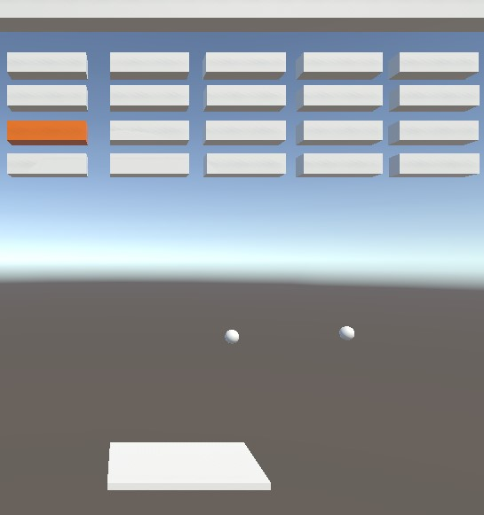
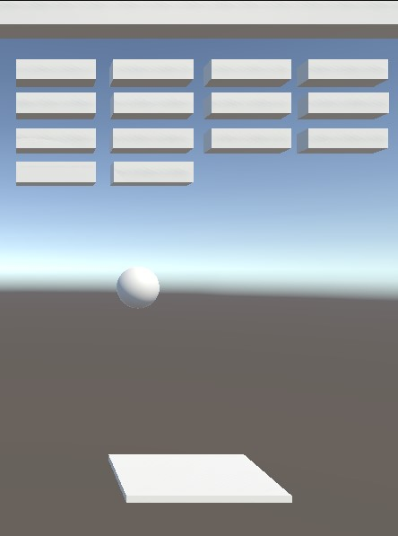
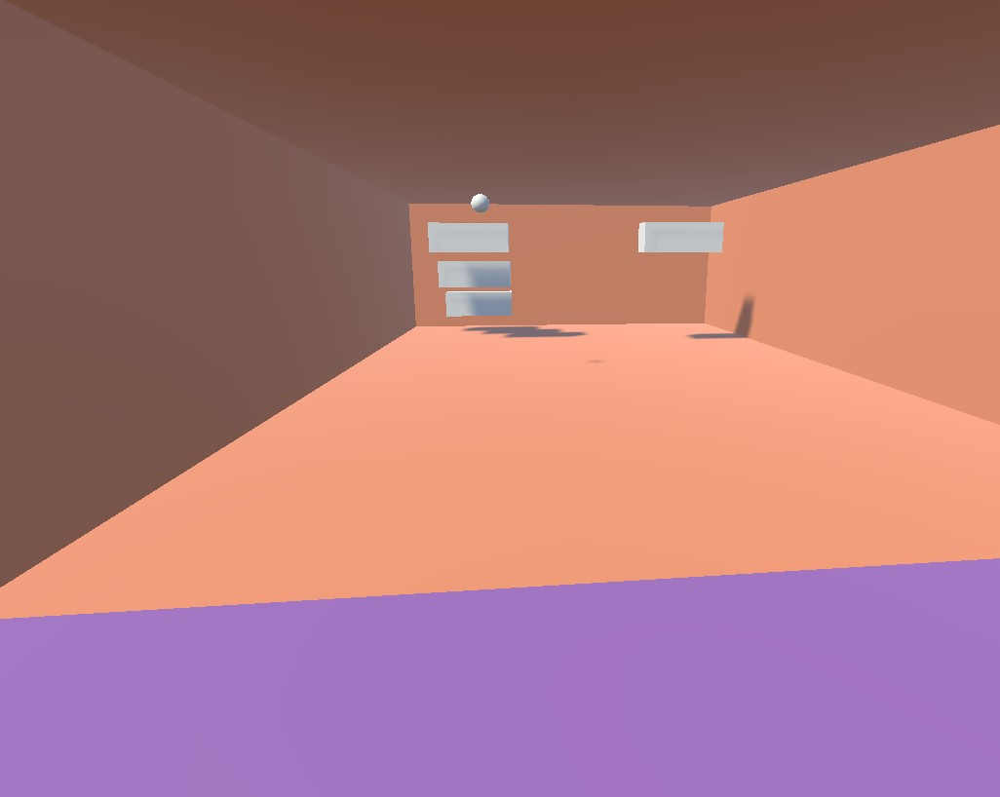
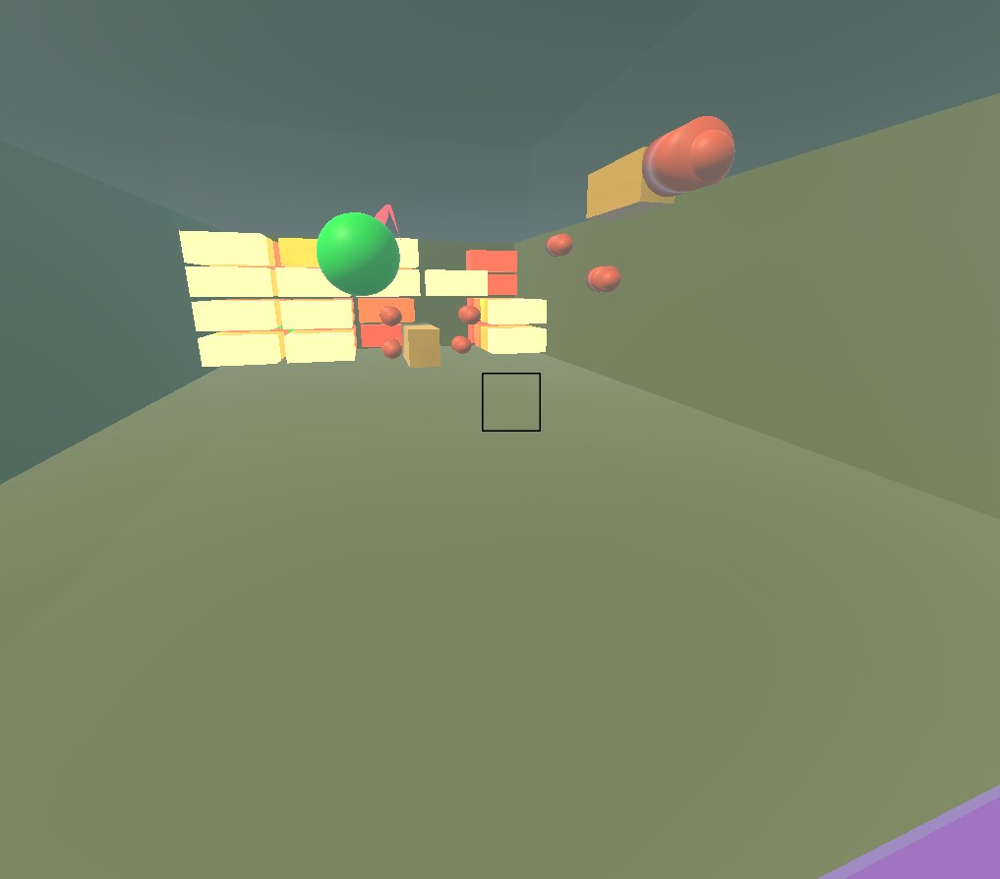
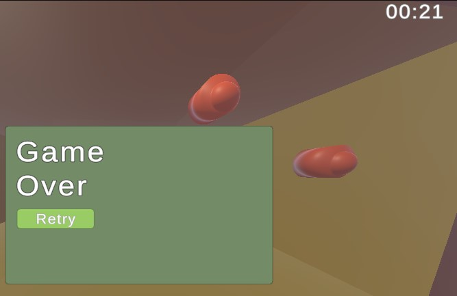

# Breakout Prototypes

## breakout-1 and 2a

Two simple prototypes testing a different respective ability.

What I was trying to learn:
- My goal was to implement a special brick with a unique color and a unique ability which would apply to the ball automatically.
- I learned that having an ability that spawns additional balls can add complexity and tension, but it would make the scene too cluttered for my future goals.

- I learned how to implement the super (big) ball power up. My goal with this ability was that the ball would go through the bricks rather than bounce off of them, destroying many with each bounce. I would use this in later prototypes.

Playtest Result:
- Playtesting made it clear that players enjoyed the super ball power up. It was satisfying to see it tear through all the bricks it touched. 

[Link to Play Prototype 1](https://egetaktak1212.github.io/game-dev-spring2025/builds/breakout-1/)
[Link to Play Prototype 2a](https://egetaktak1212.github.io/game-dev-spring2025/builds/breakout-2a/)
## breakout-2b
Breakout's implementation in 3D

I was experimenting with:
- breakout in a 3D environment where you are the paddle
- Having the ball bouncing in 3D rather than 2D, meaning the player could aim the ball more precisely.
- Having a clear field that marks a danger zone for the ball, giving the player time to hit the ball but also killing the player if they take too long.

What I learned:
- I learned how to have the ball bounce without gravity using reflections off of the collision's normals.
- from playtesters:
  - I learned that there needs to be a crosshair at the center to communicate to the player that you must look at the ball to bounce it back
  - I learned that the clear wall (danger zone) should have a visual element besides the floor to tell the player where to focus on.
  - I learned that having a lot of space behind the player for them to walk around made them lose due to the range of the player's racket.
  - I learned that I should have a visual indicator for how long the player has before they die to the ball.

[Link to Play](https://egetaktak1212.github.io/game-dev-spring2025/builds/breakout-2b/)

## Final Prototype (built off of breakout-3)

Final prototype combined with final 3D Build.
(I accidentally built the final onto the breakout-3 build file)

I was experimenting with:
- Having a shooting system.
  - I wanted to add more mechanics to spice up the gameplay, add tension, and give more for the player to do while waiting for the ball.
- An item system where you also had a magnet that you could equip.
  - the magnet's purpose was to help the player get the ball unstuck and also allow for more expression. Because the ball maintains its direction regardless of magnet bull, it could lead to more interesting strategies.
- Adding power ups. When the player destroys a special brick, they have to hit its resulting projectile to apply the super ball feature from prototype 2a. This adds risk-reward, as the big ball will generate more bullets but will clear more bricks.
- More visual communication

  - A trail to help the player track the balls direction
  - The barrier turning red upon impact with a bullet to warn the player.
  - Colors of the bullets and ball changing to indicate the player running out of time
  - A timer to help track progress and skill

I learned:
- How to use layers to avoid unwanted collisions, such as the ball bouncing off of the bullets or the bullets colliding with bricks.
- How to use trails and emission
- How to use raycasting to simulate shooting at the bullets
- How to cast projectiles from objects upon collision with the ball
- From prototypes:
   - that switching to your "pistol" by holding M2 wasn't intuitive, which I removed.
   - how players approach an FPS game, where they would easily panic and run around rather than approach the situation calmly
   - that the bullets were moving and killing the player too quickly. Under stress of many projectiles approaching, the player would easily get distracted and lose
   - that the players needed time before the game started to be situated, and a notification that they had died. Although obvious, it wasn't a priority until testing.
   - that, once again, big ball = *dopamine*

[Link to Outdated Prototype 3](https://egetaktak1212.github.io/game-dev-spring2025/builds/breakout-3/)

[Link to Play Final](https://egetaktak1212.github.io/game-dev-spring2025/builds/breakout-final/)

