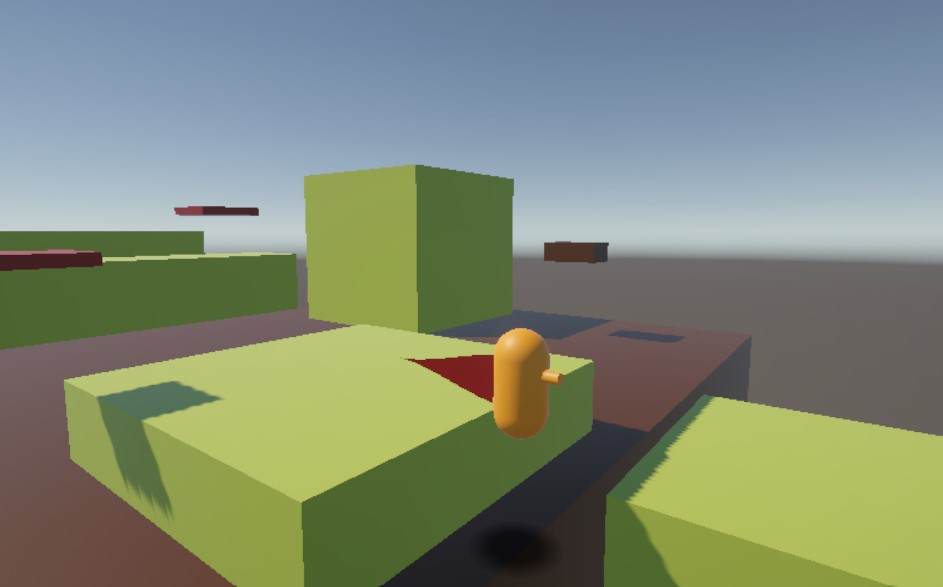
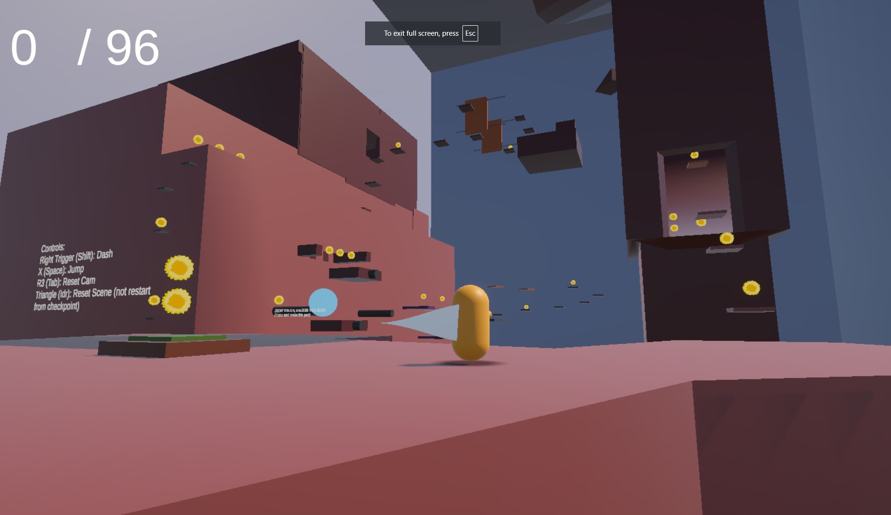
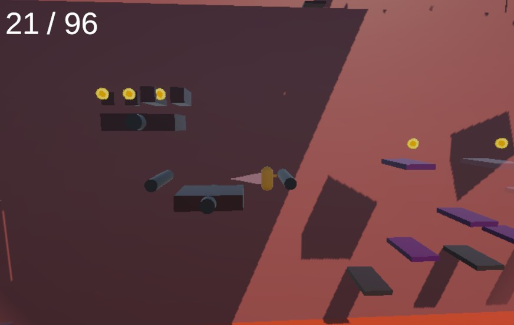

# Platformer Prototypes

## platformer-1

A simple platformer prototype with a special jump

I was experimenting with:
- special moves triggered in a small window of time. The goal was to give the player something to master/become comfortable with.
- chaining jumps/moves. I wanted the player to be able to chain their dash with their double jump + a third special jump to reach distances that otherwise seemed impossible.

I learned that:
- Making a significant jump that launches the player this far, especially when chained, would force me to make larger levels with less intricate details. I wanted to have secrets, detailed level design, and small landscapes. This would force me to go much bigger and less dense than I'd like.

[Link to Play](https://egetaktak1212.github.io/game-dev-spring2025/builds/platformer-1/)

## platformer-2
GOTY

I was experimenting with:
- soulslike level design in a platformer. I thought about implementing multiple checkpoints, but I realized it would be a greater challenge if I connected each segment of the level back to the beginning. Rather than unlocking a door or getting a checkpoint, you get an ability with allows you to go up a path you couldn't previously.
- coins to guide the player. Although the coins don't amount to anything, this allowed me to draw paths for the player to follow.
- a tall jump rather than a low wide jump. This allowed me to focus on verticality rather than horizontal distance. Now, the special jump goes higher but doesn't let you travel enough to go huge distances.
- moving platformers mimicking the feeling of a wipeout course, trying to push the player off rather than make them miss a jump.
- disappearing platforms that disappear at random offsets to keep the player on their toes.
- fixed camera perspectives for certain sections.

I learned that:
- the shorter tall jump was not moving fast enough for the player to make the jumps at the end of the game.
- the disappearing platforms being random offset was a cheap shortcut and something more concrete would be better and more reliable.
- when the player dies, the camera transitions back to the beginning, clipping through walls and exposing the secret room.
- players still struggle with depth perception.
- players wouldn't remember jumps they couldn't make previously, not returning to them after getting the correct power up. Game design doesn't stand a chance against early onset dimensia.

[Link to Play](https://egetaktak1212.github.io/game-dev-spring2025/builds/platformer-2/)

## Final Prototype (platformer-final)

Platformer-2 with small edits

I was experimenting with:
- a wider jump that was more in line with the speed the player needed to make certain jumps.
- wider coin hitboxes to avoid confusion regarding depth during the wipeout segment.
- disappearing platforms that disappear in a specific order to maintain ease.
- camera waiting and then teleporting to the player after death to avoid clipping.
- replacing the buildings with 3D models from blender.

I learned:
- replacing the buildings was going to be too complicated and required a complete redesign of most of the level.
- depth perception is still a problem, especially during the floating platforms.
- players expect the coins to do something. Fair.

[Link to Play Final](https://egetaktak1212.github.io/game-dev-spring2025/builds/platformer-final/)

