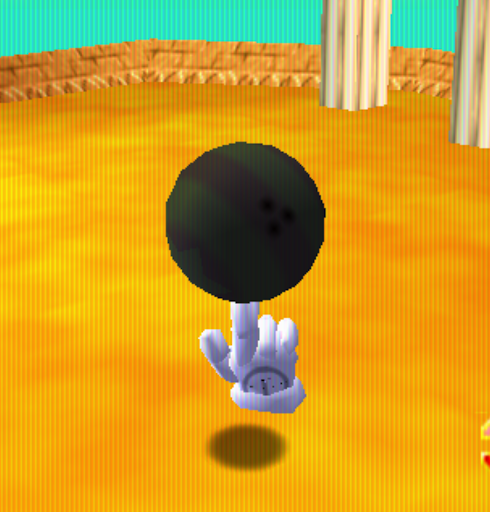
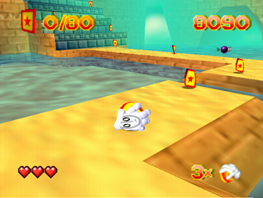
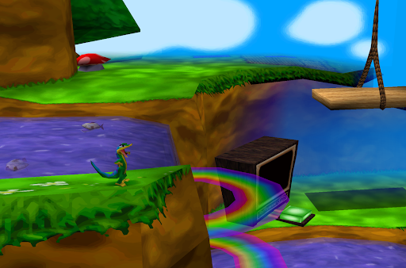
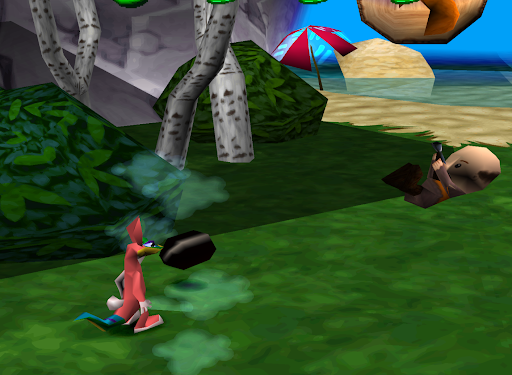
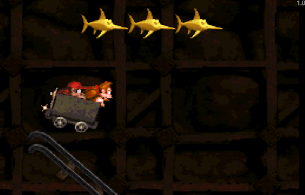
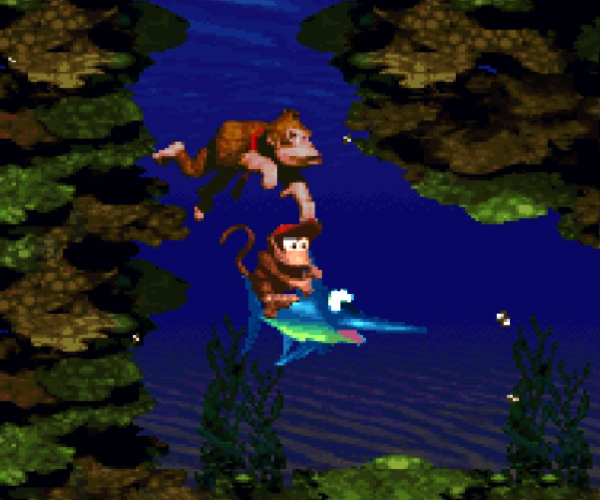

# Game 1: Glover

The first platformer I picked was Glover by Interactive Games. It was released in 1998 for the N64. The concept is simple, you are a glove and you have a ball. Your objective is to carry the ball across the level, collecting pickups, upgrades, and avoiding enemies. The ball and Glover have independent abilities, in that, Glover can jump by himself, but also has a separate jump mechanic when he’s holding the ball. Another example, Glover can throw the ball to reach higher points, and without the ball, Glover can do a cartwheel and ground pound. It plays like you are controlling two different platformers, and picking up the ball swaps from one to the other. Finally, Glover can use magic to transform the ball into other spheres, such as a bowling ball, a small rock, and a crystal.  

When on the ground, Glover has a few abilities. 
Like I mentioned, he can do a cartwheel, but he can also duck and lie on the floor. 
When he runs, upon a sudden stop, his animation takes a few extra frames to conclude, 
meaning there is a sense of sluggish, slippery movement. The unique features come in 
when Glover picks up his ball. With the ball, there are two ways to traverse, either 
holding the ball or riding on top of it. When holding the ball, it controls almost 
identically to Glover, except that the ball can roll down hills if the player isn’t 
pushing against it. However, when Glover rides the ball, it moves faster but the 
controls are inverted, meaning the player has to push down to go forward. This movement 
style is enforced when the ball falls into water and Glover can’t simply carry it and must ride it to shore.  

Glover, when without the ball, has a single and double jump. This jump goes higher and often farther than his cartwheel, which confuses me as to why the cartwheel was necessary. Regardless, his jump utilizes a system similar to what we discussed in class: tapping the jump button does a short jump while holding it results in more height and air time. If you tap the jump button and then tap again to do a double jump, Glover’s height will be around the same as if you had done one long jump. If you try to do a double jump at the peak of a long jump, however, the height of the jump isn’t increased. When Glover has his ball, his jump becomes a lot simpler and harder to control. Rather than jumping, Glover bounces the ball. So, if you jump once and let go, the ball will keep bouncing but at lower heights. You can spam the jump button to have the ball continuously bouncing, where you have to time the bounce with when you want to jump a gap or up a surface. You cannot hold the jump button for more airtime, as holding the jump button initiates Glover’s throw ability, which means the simple bounce is the extent of the ball’s jumping abilities. It’s important to note that different spheres have different jump heights. For example, the bowling ball jumps a lot less than the bouncy ball, which means throwing it makes much more sense rather than trying to platform with it.  

The level design utilizes many slopes as bounding boxes for the player. Since Glover can’t complete a level without getting the ball to the end, the player follows a linear path for the level rather than jumping up slopes that the ball can’t handle. The levels often have platforms resting on bodies of water, as to provide a punishment if the player falls off (since they will have to run back on top of the ball and cannot jump back onto the platform). The level design consists mostly of buttons to press with the ball, ledges to throw the ball over, and enemies to jump away from. The levels are very sluggish to traverse due to the ball's movement being very slippery. Additionally, the camera follows Glover but not fast enough that if you suddenly turn around, the camera will still be facing forward. This meant that most of the time I had to throw the ball, I had no idea where it was going to land since I couldn’t manually turn the camera (to my knowledge).

# Game 2: Gex: Enter the Gecko
*Note to self: don’t drink the tap water at Jerry Garcia’s*

The second game I played was Gex: Enter the Gecko by Crystal Dynamics. Released in 1998, it’s the sequel to “Gex”, a 2D platformer. If upgrading from 2D to 3D wasn’t enough, Crystal Dynamics doubled down on the referential and edgy humor of Gex, giving it more personality than I’ve ever seen in a platformer. If you’ve ever looked around and felt as though you were “trapped in Boy George’s pants”, it’s ok, Gex has been there too. The game takes place in the Media Dimension, with Gex exploring levels modeled around different genres of TV and Film. This gives the game notable variety while maintaining its satirical nature through how it mocks each genre. Gameplay wise: Gex is quite vanilla. Aside from a simple jump, all he has is a tail spin where he’ll echo the teachings of Sun Tzu with “It’s tail time”. Due to the simple gameplay, the complexity of the game lies in its presentation, level design, and charm.  

On the ground, Gex has a simple run and tail spin. He cannot roll, duck, dive, or any other fancy platforming trick. The only notable detail regarding his run is his turning speed. While playing the game, I noticed I couldn’t do precise turns, especially sharp ones. Gex would rotate at his own pace and if I was trying to turn around quickly, I’d end up overshooting my target since Gex would do an orbit rather than a straight turn. This lent to a smoother experience most of the time, since he wasn’t snapping and moved reasonably realistically. However, in key instances where I’d run past an item, turning around would be a moment of frustration. The tail spin has even less to comment on, it's a simple 360 attack that happens in less than a second. It’s less of a spin attack and more of a hitbox extending from his model. It's important to note that this isn’t a one-hit-kill, it often takes multiple tail spins to take down an enemy. One detail that I didn’t get to experiment a lot but did notice, when Gex is on ice, he slides along it at a seemingly constant speed. I’m sure this plays a more important role in later levels, and leaves potential for different types of terrain impacting gameplay.  

Gex’s jumping is a little more unique. While he doesn’t have a double jump, he does have a super/spring jump. Upon landing, if you press the jump button right as he touches down, the game will reward you with a spring sound effect and a higher jump. This jump is often necessary for more hidden collectibles that are just above the height Gex can usually reach. Otherwise, his jumping is simple without any bells or whistles. Something to note is that tapping and holding also has an impact. Tapping causes Gex to jump at around half height. I found it interesting how he doesn’t jump for the amount of time the player tapped for, instead it's a static amount every time. This tapping mechanism is also present with the spring jump, with it being cut short if the button is not held. A feature that impressed me with Gex’s jump was that he also had a vaulting mechanism. When Gex is just short of a ledge, he’ll shoot out his tongue and grab the edge, launching himself up to the top. This one was a lot more consistent than Glover and was regularly used as a mechanic rather than something to fall back on. There are jumps in this game that require the tongue and cannot be made any other way.  

My  favorite aspect of Gex was its level, enemy, visual, and sound design. Since the controls are very bare bones, the developers focused much more on making each level feel unique and each collectible satisfying. The levels are long and have surprising verticality. The game will have you jumping onto elevators, climbing walls, and backtracking to areas from a different vantage point. One example was early in the level, where a piece of the wall would push outward in an attempt to knock Gex over. Once you progress past it, you’ll eventually find a waterfall with a path at the top that leads to the roof of that moving wall. Waiting for the wall to push outward, you can jump off of it to reach a secret platform in the air. I found this looping design very engaging and impressive how different level elements were utilized in different ways, transforming an obstacle into a platforming tool. Speaking of secrets, there are many collectibles in Gex. There are screens that give health or temporary buffs, there are challenges that provide items for progression. These add flavor to each level and give every corner something to find. On top of this, Gex’s spin is utilized regularly with unique enemies acting as obstacles and challenges for the player. The variety in enemies doesn’t stop at their mechanics. You can come across flowers that swing cartoonishly large hammers, hunters that shoot homing bullets that can be redirected back to sender, bear traps that jump around like rabbits, piranhas in the water and much more, especially considering all of the above is from one level.  

I have to gush about the presentation of this game. The visuals perfectly replicate each genre, shading and textures mimicking their respective styles without any shortcuts or replicated ideas. What really blew me away was the music. Each genre has its own genre of music. The horror level had corresponding tense music, with the looney tunes level having joyful jazz. Although impressive on its own, Crystal Dynamics takes it to the next level with making it reactive to your gameplay. When a hunter shoots at Gex, and you have to run from the bullet, the soundtrack transforms to have a fast flute that indicates danger. Whenever Gex attacks an enemy, you hear a jazz sting. These don’t behave as just sound effects but blend into the music so well that a player might not even notice.

# Game 3: Donkey Kong Country

The third game I picked was Donkey Kong Country, developed by Rare in 1994. It’s an iconic 2D platformer that took the character of Donkey Kong from the arcade cabinet and Super Mario, turning him into a household name. The game sees Donkey Kong and his alleged nephew travelling Donkey Kong Island or The Kingdom of Kong (the jury’s still out on the name), through vibrant jungles, gloomy caves, or underwater areas. The game combines visual variety with electrifying music to create a continuity that’s wholly unique to Donkey Kong. One of the main features of DKC is the tag in/out system between DK and Diddy. At any time, the player can swap from one to the other, with each providing different advantages. If the player takes damage, whoever they were playing as is taken out of commission, and the player must proceed as the remaining Kong until finding a marked barrel. It has many collectibles, bananas to find, animals to ride, characters to interact with, and even more bananas to find.  

On the ground, Donkey Kong and Diddy are very similar in their fundamental behavior. They have simple left and right movement and a roll/dive that acts as an attack. One major difference is that Diddy is faster than DK, being younger and more agile. However, while DK can kill large enemies with one jump, Diddy often takes multiple. Additionally, DK can slap the ground to reveal secret bananas (this is a feature I couldn’t figure out in my playthrough, so I’m working off of what I could find online). The main form of attacking enemies is through jumping, which we’ll get to later, and rolling. The roll gives the player plenty of invincibility frames to go through the opponent while also dealing damage to them. If a roll hits an enemy, the next roll will be faster and go much farther, adding more flow to the gameplay. This simple movement system is complemented with the wild animals that DK can find, acting as power ups that also serve as collectibles. These animals include a rhino, much faster than DK and kills any enemy that he comes in contact with, a fish, and a frog. DK can also duck to move under tight passages, throw barrels to collect bananas or revive Diddy, and ride a minecart.  

Due to the simple controls, the most impressive aspects of DKC lies in its level design. However, there are still a few details to point out in the character's jumps. Like I mentioned before, Diddy can jump higher than DK, but both often need other tools to reach higher locations. To assist with jumping, there are tires that spring the player, frog pickups, barrels that shoot the player in the direction it's pointing, and vines to swing on. The tap and hold system is in play here as well, with tapping providing a noticeable and yet slight difference in how high the player jumps.  

The level design compliments every aspect of the controls and adds more to it with one off abilities, mission types, and obstacles. A small and impactful example would be the jumping enemies. Regularly, the player will come across enemies that jump in a predictable pattern, meaning that the player can try to jump from head to head of each enemy in rapid succession, potentially reaching normally unattainable heights. This is utilized in conjunction with the barrels that launch DK, since they are often secret shortcuts which require clever tricks to reach. These barrels provide a lot of visual flare and satisfaction while also testing the player’s timing. There will be obstacles that the player has to line up barrel jumps to avoid, such as a spiked bee in the way. The aforementioned unique mission types include swimming, minecart, and treasure levels. Each one of these levels utilizes an animal/ability. For example, the swimming level has a swordfish that DK can ride to swim much faster and attack opposing fish. The minecart level has the titular minecart, which provides a high octane break from the usual jungle hopping gameplay. The minecart level was especially notable since it utilized many instances of split second decisions. As the cart rides down a slope, the player is often presented with a long, safe jump that leads to bananas, or a dangerous short jump that will grant an extra life. The level design focuses on variety through the different animal abilities, enemy behavior to complement the controls, and one off missions to spice up the pacing.

